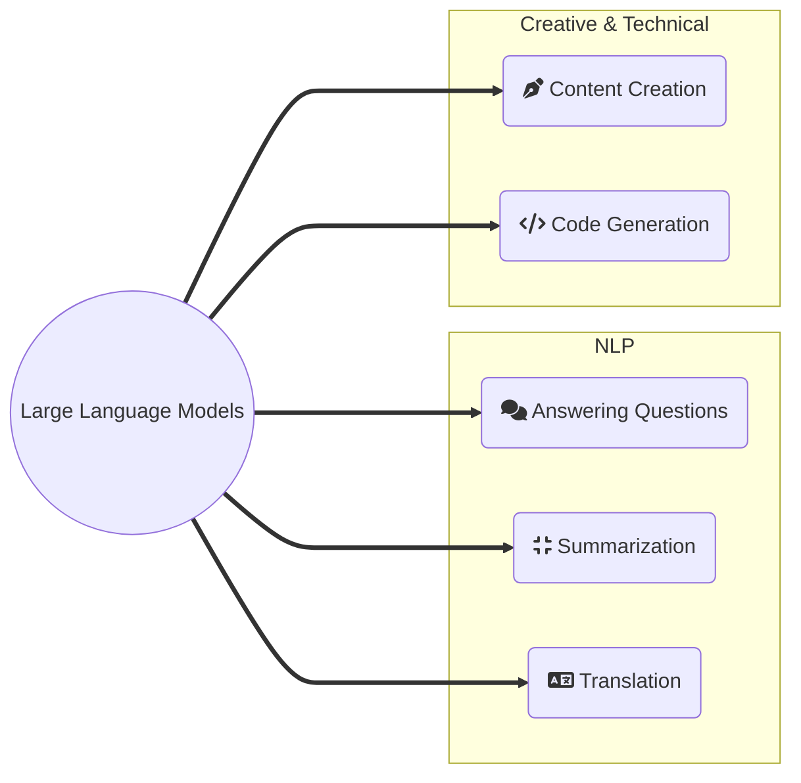

# AI Models: The Core Engine

A model in artificial intelligence is a trained algorithm that uses large datasets to perform specific tasks. It is a mathematical system most often a neural network that learns from patterns in data.

The model acts as the brain, while AI tools and interfaces like chatbots and online platforms like ChatGPT. A model can be used in multiple different use cases and systems by using the model through an API.

LLMs are the most common type of models, they are a category of deep learning models trained on immense amounts of textual data. Their fundamental skill is predicting the next most probable word in a sequence.

## Diffusion Models

